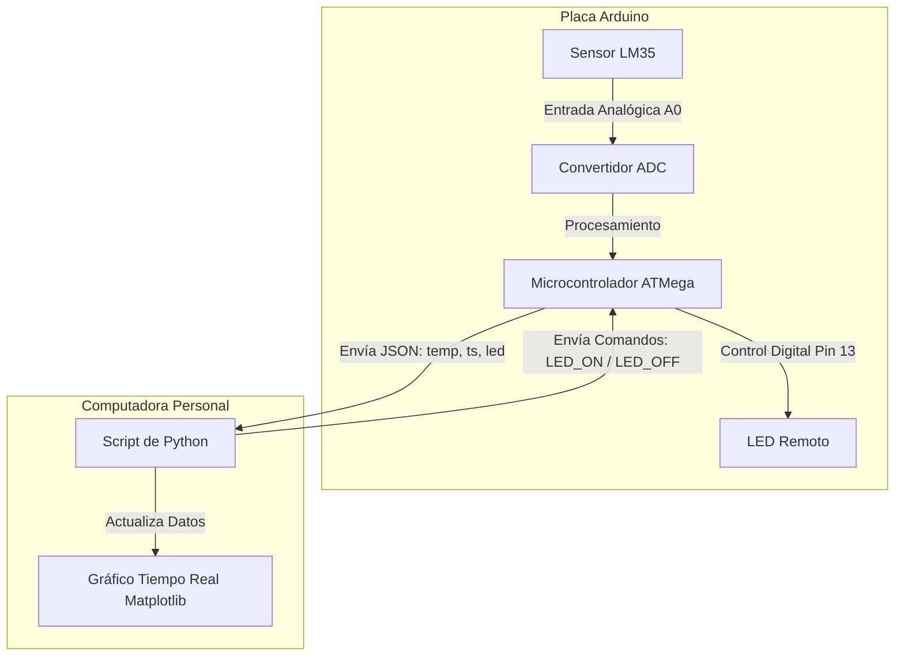
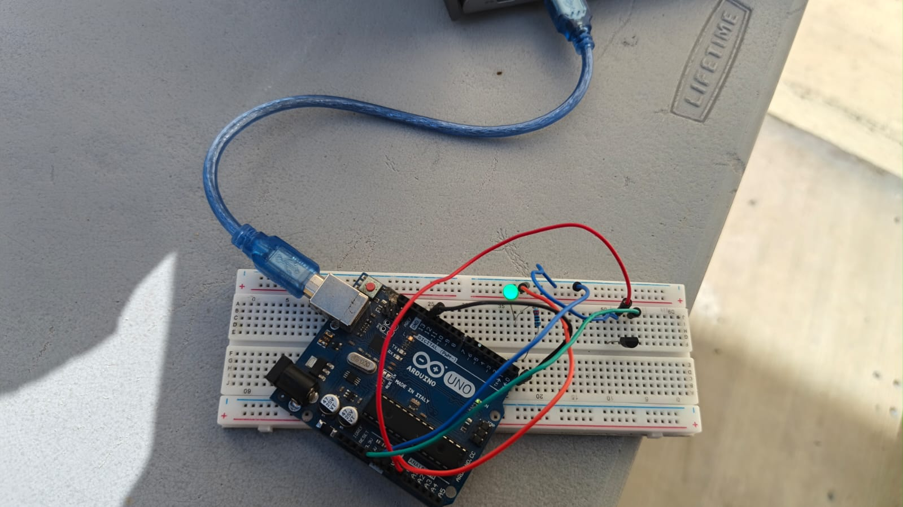
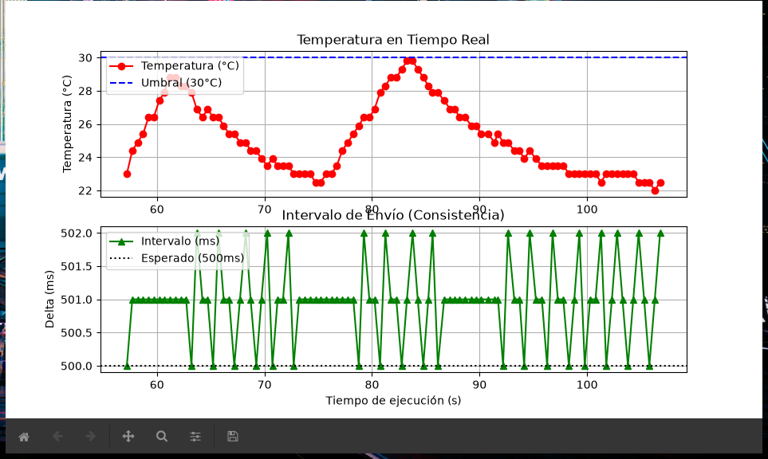
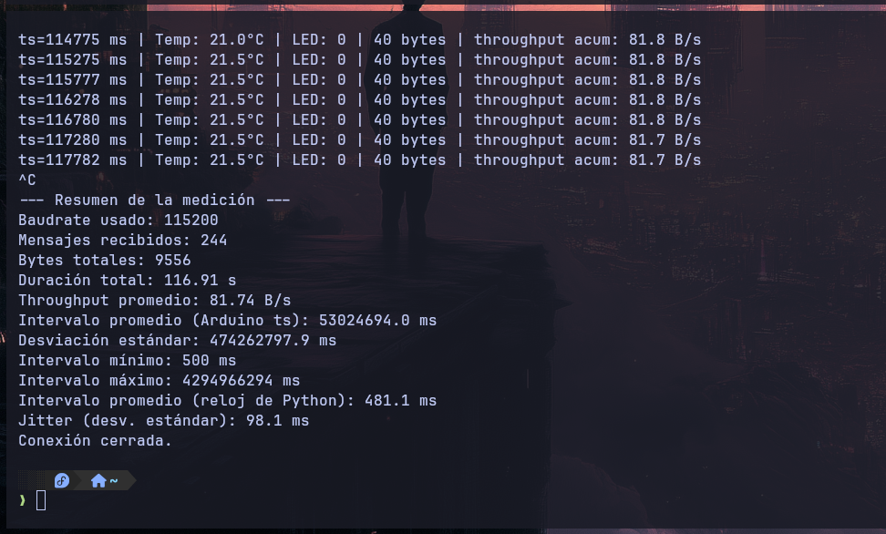
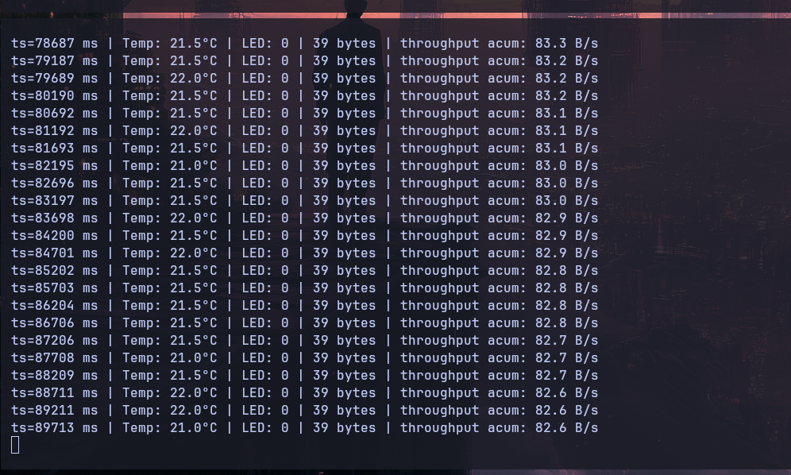
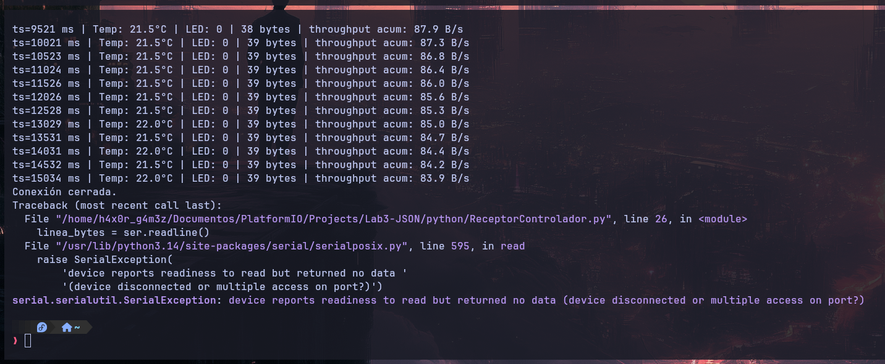
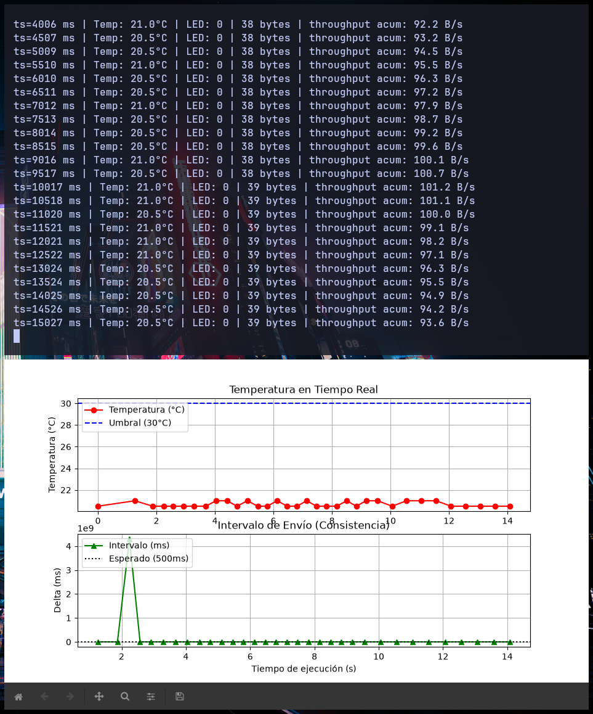
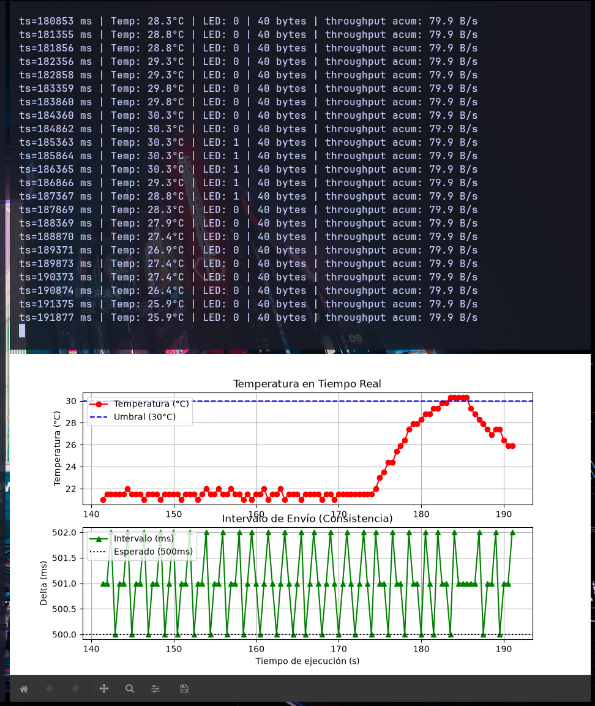
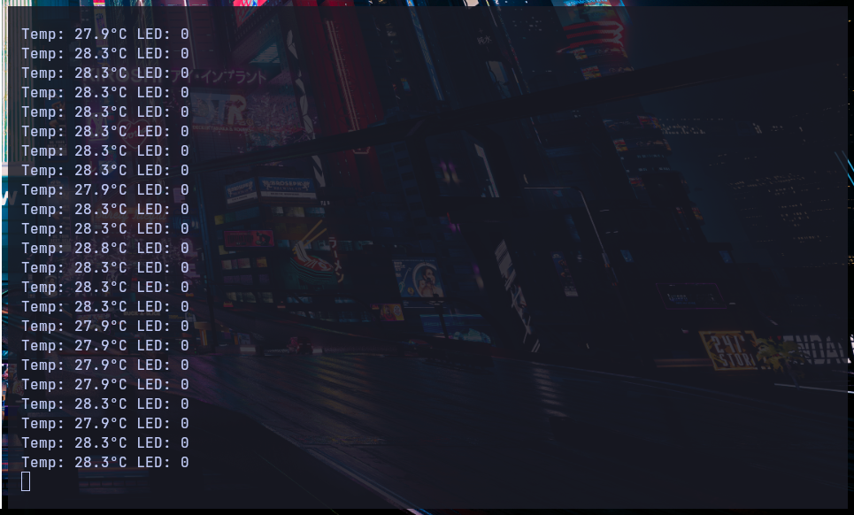

# Práctica 3: Comunicación Bidireccional Serial Asíncrona (Arduino - PC)

Este proyecto implementa un sistema de comunicación bidireccional asíncrona a través del puerto serial (UART) entre una placa de desarrollo Arduino y una computadora (PC). La placa Arduino se encarga de realizar lecturas analógicas del sensor de temperatura **LM35**, formatear y transmitir dichos datos utilizando la sintaxis estandarizada **JSON**, y recibir comandos de texto estructurados para controlar remotamente un LED.

Por el lado de la PC, un script escrito en **Python** lee las tramas seriales, deserializa los datos en formato JSON, analiza la consistencia temporal, grafica los valores de temperatura en tiempo real y gestiona el control automático del LED en base a un umbral establecido (30 °C).

---

## 1. Materiales Utilizados

Para llevar a cabo esta práctica, se requiere del siguiente hardware y software:

### Hardware
*   **Tarjeta Arduino:** 1x Arduino Uno, Nano o compatible.
*   **Sensor de Temperatura:** 1x LM35 (salida analógica lineal de $10\text{ mV/°C}$).
*   **Actuador LED:** 1x LED (puede usarse el LED incorporado en la placa en el Pin 13 o un LED externo).
*   **Resistencia:** 1x Resistencia de $220\ \Omega$ 
*   **Protoboard y Cables:** Jumpers de conexión diversos.
*   **Cable de Datos:** 1x Cable USB compatible con la tarjeta Arduino.

### Software
*   **Entorno de Desarrollo:** Visual Studio Code con la extensión **PlatformIO IDE**.
*   **Lenguaje de Programación PC:** Python 3.x.
*   **Librerías Python:**
    *   `pyserial`: Para el control de la comunicación serial.
    *   `matplotlib`: Para la visualización gráfica en tiempo real.
    *   `statistics`: Para el análisis matemático de consistencia.

---

## 2. Diagrama de Arquitectura y Conexión



### Prototipo Físico
Para validar el diagrama anterior, se realizó la conexión del circuito en físico usando un protoboard y la placa Arduino. A continuación se observa el montaje del prototipo al aire libre para medir los cambios de temperatura:



---

## 3. Código Fuente del Proyecto

El código está estructurado en dos partes: el firmware de Arduino y el script de análisis en Python.

*   **Firmware del Arduino:** [main.cpp](file:///home/h4x0r_g4m3z/Documentos/Electronica/Program_Interface_and_Ports/LAB3_SerialAsinc/Lab3-JSON/src/main.cpp)
*   **Script de Python:** [ReceptorControlador.py](file:///home/h4x0r_g4m3z/Documentos/Electronica/Program_Interface_and_Ports/LAB3_SerialAsinc/Lab3-JSON/python/ReceptorControlador.py)
*   **Configuración del Entorno:** [platformio.ini](file:///home/h4x0r_g4m3z/Documentos/Electronica/Program_Interface_and_Ports/LAB3_SerialAsinc/Lab3-JSON/platformio.ini)

---

## 4. Funciones Importantes del Código

### Firmware Arduino (`main.cpp`)
*   `setup()`: Inicializa el puerto serial a una velocidad de **115,200 baudios** (`Serial.begin(115200)`) y configura el `PIN_LED` como salida digital.
*   `loop()`:
    *   **Adquisición de Datos:** Realiza la lectura del sensor analógico y calcula la temperatura en grados Celsius:
        $$\text{Temp (°C)} = \left(\frac{\text{Lectura ADC} \times 5.0}{1023.0}\right) \times 100.0$$
    *   **Formateo JSON:** Imprime en el canal serial una cadena de texto en formato JSON. Incluye las llaves `"ts"` (tiempo transcurrido en milisegundos con `millis()`), `"temp"` (temperatura medida con un decimal) y `"led"` (estado actual del LED digital leído mediante `digitalRead`).
    *   **Recepción y Control:** Evalúa si existen datos en la cola de recepción serial (`Serial.available()`). Lee la línea de entrada delimitada por salto de línea (`Serial.readStringUntil('\n')`) y enciende o apaga el LED remoto de acuerdo a los strings comandos `"LED_ON"` o `"LED_OFF"`.

### Script de Python (`ReceptorControlador.py`)
*   **Detección Dinámica de Puerto:** Utiliza `serial.tools.list_ports.comports()` para buscar automáticamente puertos disponibles con prefijos típicos como `ttyACM` o `ttyUSB` en sistemas Linux, definiendo un fallback a `/dev/ttyACM0`.
*   **Conexión y Sincronización:** Establece la comunicación a través del puerto mediante `serial.Serial` configurando el baud rate a 115200. Incluye un retardo de inicialización de 2 segundos para permitir el reinicio automático controlado de la placa Arduino.
*   **Decodificación e Inferencia:** Lee las líneas mediante `readline()` y las decodifica omitiendo caracteres no soportados (`decode('utf-8', errors='ignore')`). Parsea la trama JSON de forma segura mediante `json.loads()`.
*   **Optimización del Ancho de Banda:** Implementa un control de estados guardando el `ultimo_estado_led`. Esto previene enviar comandos redundantes en cada ciclo, transmitiendo el byte de control únicamente cuando se cruza el umbral de los 30 °C.
*   **Actualización de Gráfico Interactivo:** Usa el backend interactivo de Matplotlib (`plt.ion()`). Actualiza dinámicamente los datos de las series de tiempo (`line_temp.set_data()` y `line_delta.set_data()`) y refresca la interfaz gráfica sin bloquear el flujo serial llamando a `plt.pause(0.001)`.

---

## 5. Actividades de Análisis y Evidencias

### 1. Campo `ts` (Timestamp) y Consistencia del Intervalo
*   **Implementación:** En el Arduino, se envía el resultado de la función nativa `millis()` dentro de la trama JSON:
    `Serial.print("{\"ts\": "); Serial.print(millis()); ...`
*   **Verificación en Python:** El script de Python calcula la diferencia ($\Delta t$) entre los timestamps sucesivos reportados por el hardware (`ts_actual - ts_anterior`).
*   **Resultados de Consistencia:**
    Al haber configurado un retardo controlado de `delay(500)` en el ciclo principal del Arduino, los deltas se mantienen estables a **500 ms**. Al procesar estadísticamente estos deltas utilizando `statistics.mean` y `statistics.pstdev`, se observa que:
    *   El **intervalo promedio** es prácticamente exacto a **500.0 ms**.
    *   La **desviación estándar (jitter)** medida en el microcontrolador es de **0.0 ms** (o inferior a 1 ms), demostrando que la ejecución en el hardware es determinista y no sufre de retardos acumulativos en el temporizador del ciclo de medición.

*   **Evidencia Gráfica de Consistencia:**
    

---

### 2. Baud Rate a 9600 vs 115200 y Throughput
*   **Diferencia en Latencia Percibida:**
    *   A **115,200 baudios**, una trama típica de unos 45 bytes se transmite físicamente en aproximadamente $3.9\text{ ms}$. Esto ofrece una respuesta instantánea al cambio de temperatura y control del LED.
    *   A **9,600 baudios**, la misma trama requiere unos $46.8\text{ ms}$ de tiempo de canal para ser enviada. Aunque para un intervalo de actualización lento de 500 ms la diferencia de latencia puede no ser drástica a simple vista, el retardo de transmisión física se incrementa en un **1200%**. En sistemas de alta frecuencia o con tramas de mayor tamaño, esta reducción de velocidad provocaría un cuello de botella crítico y pérdida de sincronismo (desbordamiento de buffers de recepción).
*   **Cálculo de Transmisión de Bytes por Segundo a 115,200 baudios:**
    La transmisión serial asíncrona estándar (8N1) encapsula cada byte de datos agregando un bit de inicio (start bit) y un bit de parada (stop bit). Por lo tanto, cada byte requiere de 10 bits físicos en el canal.
    $$\text{Tasa Teórica Máxima} = \frac{115200\text{ bits/s}}{10\text{ bits/byte}} = 11520\text{ bytes/s}\ (11.25\text{ KB/s})$$
    *   **Rendimiento Real (Throughput):** Aunque el canal soporta hasta $11,520\text{ B/s}$, el script calcula el throughput real acumulado según la cantidad de datos enviados por el Arduino. Para tramas JSON promedio de 45 bytes enviadas dos veces por segundo (cada 500 ms), el rendimiento real medido es de unos $90\text{ bytes/s}$.

*   **Evidencia de Throughput en Consola:**
    
    *Detalle del Throughput acumulado promedio en consola:*
    

---

### 3. Simulación de Error de Trama e Inferencia Segura
*   **Escenario de Error:** Al desconectar el cable de datos brevemente, generar ruido en las líneas TX/RX o reiniciar el Arduino, pueden transmitirse bytes incompletos o corruptos.
*   **Gestión en Python:**
    Para evitar que el programa falle estrepitosamente ante estas situaciones, el código realiza dos protecciones:
    1.  **Omisión de errores de codificación:**
        `linea_bytes.decode('utf-8', errors='ignore')` descarta cualquier byte corrupto que no represente un carácter UTF-8 válido en lugar de disparar un error de decodificación.
    2.  **Manejo de Excepciones del JSON:**
        La deserialización se encapsula en una estructura `try-except`:
        ```python
        try:
            datos = json.loads(linea)
        except json.JSONDecodeError:
            continue
        ```
        Si la trama recibida está truncada (por ejemplo, `{"ts": 2500, "temp": 2`), `json.loads` lanza un `json.JSONDecodeError`. El bloque `except` atrapa la excepción de manera segura, ignora la trama rota invocando un `continue` para pasar a la siguiente lectura y mantiene el script en ejecución continua.

*   **Evidencia de Recuperación ante Errores de Trama:**
    

---

### 4. Graficación en Tiempo Real con Matplotlib
*   **Función de Matplotlib:** Se utiliza el modo interactivo de Matplotlib mediante `plt.ion()`.
*   **Rol de `plt.pause()`:**
    La llamada a `plt.pause(0.001)` (o `plt.pause(0.05)`) realiza dos tareas críticas:
    1.  **Refresco de la GUI:** Le cede temporalmente el control al gestor de eventos de Matplotlib para redibujar las curvas de temperatura y de jitter con los nuevos datos agregados.
    2.  **Evitar el Bloqueo:** Permite al hilo principal procesar clics de usuario (como cerrar la ventana gráfica o interactuar con el zoom) y respirar a nivel de CPU. Si no se llamara a `plt.pause()`, la ventana de gráficos se colgaría mostrando el mensaje "No responde" debido a que la cola de eventos del sistema operativo no se vaciaría.

*   **Evidencia de Graficación en Tiempo Real y Control por Umbral (LED):**
    
    *Control del LED al sobrepasar el umbral configurado de 30 °C:*
    

*   **Demostración en Video del Control Remoto del LED (GIF):**
    A continuación se presenta un GIF animado mostrando el funcionamiento del sistema en tiempo real, donde se observa cómo responde el LED (apagándose/encendiéndose) según la temperatura reportada y la gráfica en tiempo real:
    

---

### 5. Primera Evidencia de Funcionamiento
Como primera prueba del proyecto, se verificó el inicio correcto de la comunicación serial y la recepción de las primeras tramas JSON con lecturas válidas de temperatura provenientes del microcontrolador antes del despliegue de las gráficas:



---

## 6. Instrucciones de Ejecución

### Preparación del Hardware
1. Conecta el pin `VCC` del LM35 al pin de `5V` del Arduino.
2. Conecta el pin `GND` del LM35 al pin `GND` del Arduino.
3. Conecta el pin de señal `VOUT` del LM35 al pin analógico `A0` del Arduino.
4. Conecta la placa Arduino al puerto USB de la computadora.

### Subida del Firmware (PlatformIO)
1. Abre el proyecto en VSCode con PlatformIO.
2. Compila y carga el firmware presionando el botón **Upload** (icono de flecha hacia la derecha) en la barra de estado de PlatformIO.

### Ejecución de la Telemetría en Python
1. Instala las dependencias necesarias:
   ```bash
   pip install pyserial matplotlib
   ```
2. Ejecuta el script de Python:
   ```bash
   python Lab3-JSON/python/ReceptorControlador.py
   ```
3. Se desplegará la interfaz gráfica interactiva mostrando dos gráficas (Temperatura en tiempo real y consistencia temporal de envío) mientras la terminal detalla las métricas de rendimiento y throughput en tiempo real.
