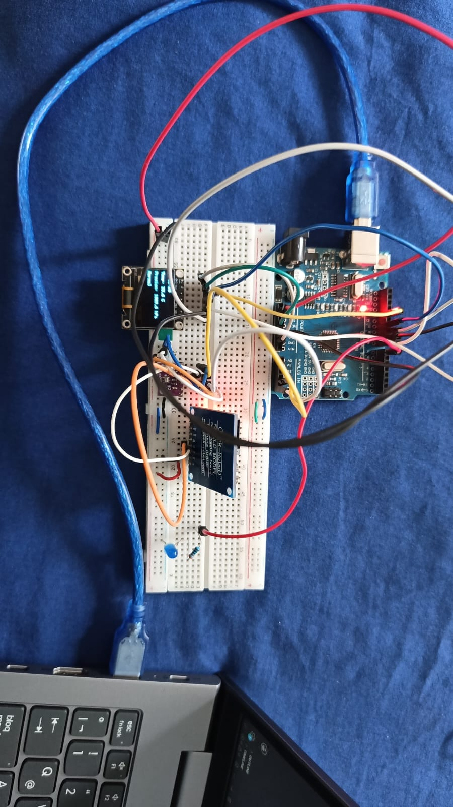

# Práctica de Laboratorio 4: Protocolos de Comunicación I2C y SPI en Sistemas Embebidos

Este repositorio contiene el código, la configuración y la documentación para la **Práctica de Laboratorio 4** de la asignatura **Interfaces de Programación y Puertos**. 

El objetivo principal es implementar un sistema híbrido que conecte sensores y actuadores a través de dos de los buses de comunicación serial sincrónica más utilizados en la industria: **I2C (Inter-Integrated Circuit)** y **SPI (Serial Peripheral Interface)**. Se analizan de forma práctica sus velocidades, direccionamiento, ventajas y limitaciones físicas.

---

## 📌 Objetivos de la Práctica
1. **Comunicación I2C:** Conectar y leer datos de temperatura y presión del sensor de precisión **BME280** y la hora/fecha del módulo de reloj de tiempo real (RTC) **DS1307** utilizando la biblioteca `Wire.h`.
2. **Comunicación SPI:** Mostrar los datos en tiempo real en una pantalla gráfica **OLED SSD1306** configurada mediante interfaz SPI por hardware.
3. **Análisis de Coexistencia I2C:** Verificar el direccionamiento e inmunidad a colisiones al conectar múltiples dispositivos al mismo par de líneas SDA/SCL.
4. **Análisis de Rendimiento I2C:** Aumentar la velocidad del bus I2C a **400 kHz (Fast Mode)** y medir el impacto temporal mediante telemetría con `micros()`.
5. **Control por Histéresis:** Implementar una alarma visual (LED) con un umbral configurable y margen de histéresis para evitar oscilaciones espurias.

---

## 🛠️ Hardware Utilizado y Conexiones (Pinout)

El microcontrolador principal es un **Arduino Uno** (ATmega328P). A continuación, se detalla el esquema de conexiones físicas para cada uno de los periféricos:

### 1. Pantalla OLED SSD1306 (Bus SPI)
El OLED utiliza SPI por hardware para lograr la máxima tasa de refresco:
| Pin OLED | Pin Arduino Uno | Descripción |
|---|---|---|
| **VCC** | 5V / 3.3V | Alimentación de la pantalla |
| **GND** | GND | Referencia de tierra |
| **CLK (D0)** | Pin 13 (SCK) | Reloj de SPI por Hardware |
| **MOSI (D1)** | Pin 11 (MOSI) | Datos de SPI por Hardware (Master-Out Slave-In) |
| **RST (RES)** | Pin 8 | Reset del controlador OLED |
| **DC** | Pin 9 | Selección de Datos / Comando (Data/Command) |
| **CS** | Pin 10 | Selección de Dispositivo (Chip Select) |

### 2. Sensores en Bus I2C (Compartido)
El sensor **BME280** y el RTC **DS1307** comparten el bus I2C de forma paralela. Se conectan directamente a los pines analógicos A4 y A5 o a las salidas SDA/SCL dedicadas:
| Pin Dispositivo | Pin Arduino Uno | Descripción |
|---|---|---|
| **BME280 VCC** | 3.3V | **¡Importante!** El sensor BME280 opera a 3.3V. |
| **DS1307 VCC** | 5V | El RTC opera a 5V. |
| **GND (Ambos)**| GND | Tierra común |
| **SDA (Ambos)**| Pin A4 (SDA) | Línea de Datos Serial (I2C) |
| **SCL (Ambos)**| Pin A5 (SCL) | Línea de Reloj Serial (I2C) |

### 3. Actuador de Alarma (GPIO)
* **LED Alarma:** Conectado al **Pin Digital 7** con una resistencia limitadora de corriente de $220\ \Omega$ en serie hacia GND.

---

## 💻 Estructura del Código Fuente

El desarrollo se gestionó mediante un proyecto de [PlatformIO](file:///home/h4x0r_g4m3z/Documentos/Electronica/Program_Interface_and_Ports/LAB4_I2C_SPI/Comunicacion_SPI_e_I2S/platformio.ini).

El código fuente principal está en [main.cpp](file:///home/h4x0r_g4m3z/Documentos/Electronica/Program_Interface_and_Ports/LAB4_I2C_SPI/Comunicacion_SPI_e_I2S/src/main.cpp) y se divide de la siguiente manera:

* **Inicialización ([setup()](file:///home/h4x0r_g4m3z/Documentos/Electronica/Program_Interface_and_Ports/LAB4_I2C_SPI/Comunicacion_SPI_e_I2S/src/main.cpp#L27-L97)):** 
  * Se inicializa el puerto serie a 115200 bps.
  * Se activa el bus I2C mediante `Wire.begin()` y se aumenta inmediatamente la velocidad de comunicación a **400 kHz** con [`Wire.setClock(400000)`](file:///home/h4x0r_g4m3z/Documentos/Electronica/Program_Interface_and_Ports/LAB4_I2C_SPI/Comunicacion_SPI_e_I2S/src/main.cpp#L37-L39).
  * Se inicializan y autodetectan los dispositivos: OLED en SPI (pines 8, 9, 10), BME280 en la dirección I2C `0x76` y RTC en `0x68`.
  * Se configuran los parámetros internos de sobremuestreo del BME280 para obtener lecturas estables.
  
* **Bucle de Control ([loop()](file:///home/h4x0r_g4m3z/Documentos/Electronica/Program_Interface_and_Ports/LAB4_I2C_SPI/Comunicacion_SPI_e_I2S/src/main.cpp#L99-L161)):**
  * **Telemetría Temporal ([micros()](file:///home/h4x0r_g4m3z/Documentos/Electronica/Program_Interface_and_Ports/LAB4_I2C_SPI/Comunicacion_SPI_e_I2S/src/main.cpp#L100-L106)):** Mide con precisión el tiempo que tarda la lectura combinada de temperatura y presión del BME280 y la fecha/hora del RTC a través del bus I2C.
  * **Lógica de Histéresis ([alarmaActiva](file:///home/h4x0r_g4m3z/Documentos/Electronica/Program_Interface_and_Ports/LAB4_I2C_SPI/Comunicacion_SPI_e_I2S/src/main.cpp#L108-L115)):** Compara la temperatura actual con los umbrales configurados (`TEMP_UMBRAL_ON = 35.0 °C` y `TEMP_UMBRAL_OFF = 33.0 °C`).
  * **Salida de Datos:** Imprime la información y telemetría por Monitor Serial y actualiza los campos de la pantalla OLED mediante SPI.

> [!NOTE]
> Todo el texto estático enviado al puerto serie o a la pantalla OLED está envuelto en la macro `F()` (por ejemplo, `Serial.println(F("Iniciando..."))`). Esto almacena las cadenas de caracteres directamente en la memoria Flash (programa) en lugar de copiarlas a la SRAM al iniciar, ahorrando un valioso espacio de los 2 KB disponibles en el ATmega328P.

---

## 📈 Actividades de Análisis y Resultados

### 1. Coexistencia de Dispositivos en el Bus I2C
En el bus I2C, la diferenciación de dispositivos no se hace mediante cables de selección físicos (como SPI), sino mediante software utilizando una **dirección única de 7 bits** enviada al inicio de cada trama de datos.

* **Dirección del BME280:** `0x76` (o `0x77` según la conexión del pin SDO).
* **Dirección del RTC DS1307:** `0x68` (dirección fija por hardware de fábrica).

Al estar conectados en paralelo sobre las mismas líneas (A4/SDA y A5/SCL), el maestro (Arduino) envía la dirección del sensor con el que desea hablar. El dispositivo cuya dirección coincide responde con un bit de reconocimiento (ACK) y toma el control temporal de la transmisión. Los demás dispositivos ignoran la trama al no coincidir su dirección. En las pruebas de laboratorio, ambos sensores funcionaron simultáneamente y proporcionaron datos correctos de manera ininterrumpida sin generar ningún tipo de colisión o interferencia mutua.

### 2. Incremento de Velocidad a 400 kHz (`Wire.setClock(400000)`)
Por defecto, la librería `Wire` de Arduino inicializa el bus I2C a la velocidad estándar de **100 kHz**. 

* Al configurar [`Wire.setClock(400000)`](file:///home/h4x0r_g4m3z/Documentos/Electronica/Program_Interface_and_Ports/LAB4_I2C_SPI/Comunicacion_SPI_e_I2S/src/main.cpp#L37-L39), el bus opera en **Fast Mode (400 kHz)**.
* **Medición de Tiempo:** La lectura combinada de temperatura, presión y la hora del RTC tarda sustancialmente menos microsegundos comparado con el modo de 100 kHz. Esto reduce el tiempo que el microcontrolador pasa bloqueado esperando la transferencia de datos en el bus I2C, liberando tiempo de procesamiento en la CPU para otras tareas secundarias o de control.

### 3. Alarma Visual LED con Histéresis
Para evitar el parpadeo rápido (oscilación destructiva) del LED de alarma cuando la temperatura oscila muy cerca de los 35.0 °C debido al ruido térmico o variaciones del sensor, se implementó un control con **histéresis de dos umbrales**:
* **Umbral de Activación (Encendido):** $\ge 35.0\text{ °C}$
* **Umbral de Desactivación (Apagado):** $\le 33.0\text{ °C}$

```cpp
if (!alarmaActiva && t >= TEMP_UMBRAL_ON) {
  alarmaActiva = true;
} else if (alarmaActiva && t <= TEMP_UMBRAL_OFF) {
  alarmaActiva = false;
}
digitalWrite(LED_ALARMA, alarmaActiva ? HIGH : LOW);
```
Si la temperatura sube a 35.0 °C, el LED se enciende. Si la temperatura baja ligeramente a 34.8 °C, el LED permanece encendido y solo se apagará si la temperatura desciende por debajo del límite de 33.0 °C. Esto dota al sistema de estabilidad industrial.

---

## ❓ Preguntas de Análisis Teórico

### A. ¿Por qué SPI es más rápido que I2C?
La superioridad en velocidad de SPI sobre I2C radica en su arquitectura física y de protocolo:
1. **Full-Duplex vs. Half-Duplex:** SPI posee líneas de transmisión y recepción independientes y simultáneas (**MOSI** y **MISO**), mientras que I2C depende de una sola línea bidireccional (**SDA**) en la cual los datos solo fluyen en un sentido a la vez.
2. **Selección por Hardware vs. Direccionamiento por Software:** SPI utiliza una línea dedicada física llamada **Chip Select (CS)** para activar al esclavo objetivo al instante. I2C debe enviar la dirección de 7 bits del esclavo mediante software por el propio bus antes de transmitir datos, lo que genera sobrecarga (overhead).
3. **Driver Push-Pull vs. Open-Drain (Colector Abierto):** SPI utiliza drivers de salida activos tipo *Push-Pull*, capaces de generar transiciones lógicas de voltaje extremadamente veloces (soportando frecuencias de reloj de 10 MHz a 80 MHz o más). I2C usa salidas tipo *Open-Drain* que dependen de resistencias de *pull-up* externas para elevar la tensión de la línea; la carga capacitiva de la línea frena estas subidas de tensión, limitando físicamente la velocidad máxima a 400 kHz (o hasta 1 MHz / 3.4 MHz en modos especiales poco comunes).
4. **Ausencia de bits de confirmación (ACK):** En I2C, cada byte transmitido requiere un bit ACK/NACK de vuelta, perdiendo un bit de ancho de banda por cada byte. SPI simplemente transmite bits de forma continua sin confirmar la recepción a nivel físico.

### B. ¿En qué situaciones se preferiría I2C sobre SPI?
I2C se prefiere en las siguientes aplicaciones debido a su simplicidad y eficiencia de recursos:
1. **Limitación de Pines del Microcontrolador:** I2C solo utiliza 2 pines (SDA y SCL) para conectar múltiples dispositivos (hasta 127 direccionables). SPI necesita al menos 3 pines comunes y **1 pin Chip Select (CS) extra por cada esclavo**. Conectar 10 sensores por SPI requeriría 13 pines GPIO, mientras que por I2C se siguen necesitando únicamente 2 pines.
2. **Simplicidad en el Diseño del PCB:** Trazar dos pistas compartidas para intercomunicar múltiples dispositivos en un circuito impreso es mucho más sencillo y requiere menos espacio físico que el cableado de múltiples líneas de control de SPI.
3. **Dispositivos de Baja Frecuencia:** Los sensores ambientales (como temperatura, presión o humedad), memorias EEPROM de baja capacidad o módulos de tiempo real (RTC) varían sus datos a velocidades muy bajas. El ancho de banda de I2C es más que suficiente, haciendo innecesaria la velocidad de SPI.
4. **Sistemas Multi-maestro:** I2C tiene soporte nativo para que múltiples maestros compartan e inicien transacciones en el mismo bus mediante algoritmos de detección de colisión y arbitraje de hardware. SPI es estrictamente de maestro único (Single-Master).

---

## 📸 Evidencias del Proyecto

A continuación, se presentan las pruebas de funcionamiento tomadas durante la realización de la práctica en el laboratorio:

### Circuito Físico Montado
Aquí se observa la interconexión física del Arduino Uno con la pantalla OLED SSD1306 (SPI), el sensor de precisión BME280 (I2C) y el RTC DS1307 (I2C) compartiendo el bus.



---

### Demostración de Funcionamiento
Los siguientes GIFs muestran el sistema en funcionamiento real:

1. **Lectura y Visualización General:** El sistema inicializa correctamente todos los buses. Se observa la hora actualizada del RTC en tiempo real y la lectura constante de la temperatura y la presión provistas por el sensor BME280.
   
   

2. **Prueba de Coexistencia I2C y Alarma Térmica:** Se demuestra la coexistencia de ambos sensores I2C leyendo datos del RTC y BME280 simultáneamente en el bus rápido de 400 kHz. Al aplicar calor al BME280 para superar el umbral de 35.0 °C, la pantalla cambia su estado a `ALARMA! >35C` y el LED rojo de advertencia (Pin 7) se enciende instantáneamente. El LED se apaga solo al enfriarse bajo el umbral de histéresis (33.0 °C).

   

---

## 🚀 Instrucciones para Ejecutar el Proyecto

El proyecto está estructurado con **PlatformIO**. Para abrirlo, compilarlo y cargarlo:

1. Instala la extensión **PlatformIO IDE** en VS Code.
2. Clona o copia la carpeta [Comunicacion_SPI_e_I2S](file:///home/h4x0r_g4m3z/Documentos/Electronica/Program_Interface_and_Ports/LAB4_I2C_SPI/Comunicacion_SPI_e_I2S) en tu espacio de trabajo.
3. Abre la carpeta del proyecto en VS Code (`Archivo > Abrir Carpeta...`).
4. Conecta tu placa Arduino Uno mediante USB.
5. Ejecuta la compilación y subida presionando el ícono de la flecha en la barra de estado de PlatformIO (o ejecuta `pio run -t upload` en la terminal).
6. Abre el monitor serie integrado (`pio device monitor`) a una velocidad de **115200 baudios** para ver las lecturas en tiempo real y el tiempo de ejecución en microsegundos de las lecturas I2C.
