# Laboratorios Tkinter — Interfaces Gráficas con Python

Manual de prácticas de **Programación de Interfaces y Puertos** (Ingeniería en Sistemas Computacionales). Desarrollo de interfaces HMI (Human-Machine Interface) funcionales para comunicar una PC con microcontroladores, transitando desde la ventana básica hasta un dashboard serial en tiempo real.

## Requisitos de Instalación
* **Python 3.8+** (incluye `tkinter`).
* **Librerías necesarias**:
  ```bash
  pip install matplotlib pyserial pandas
  ```

---

## Detalle de Laboratorios

### 1. Primera Ventana y Widgets Esenciales (Lab Tk-1)
* **Objetivos**: `tk.Tk`, `Label`, `Button`, `Entry`, `StringVar`, `messagebox`.
* **Descripción**: Construcción de la primera ventana interactiva con Python. Se explora el *event loop* y el manejo de widgets fundamentales.
* **Evidencias**:
  <table>
    <tr>
      <td>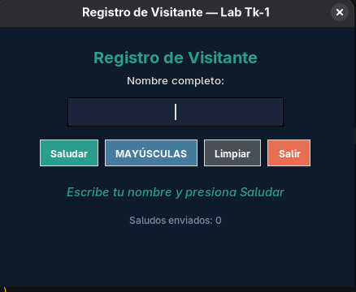</td>
      <td>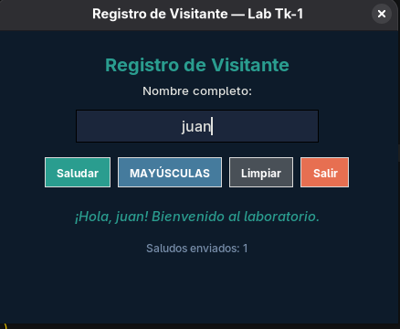</td>
      <td>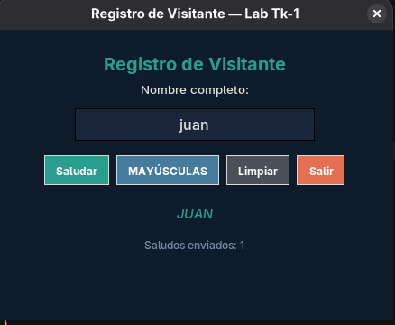</td>
      <td>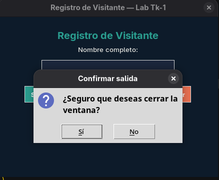</td>
    </tr>
  </table>

### 2. Layout y Organización de Widgets (Lab Tk-2)
* **Objetivos**: `pack`, `grid`, `place`, `LabelFrame`, `ttk.Notebook`, `ttk.Progressbar`.
* **Descripción**: Dominio de la colocación y alineación estructurada de widgets. Uso de pestañas (`ttk.Notebook`) y organización modular de la interfaz.
* **Evidencias**:
  <table>
    <tr>
      <td>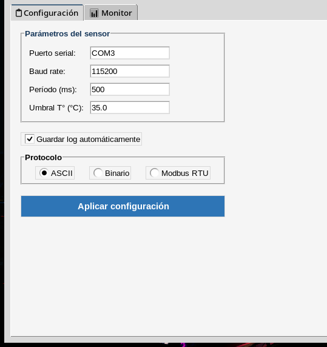</td>
      <td>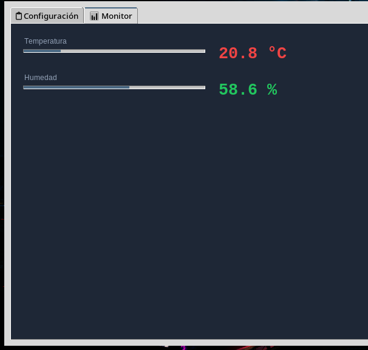</td>
      <td>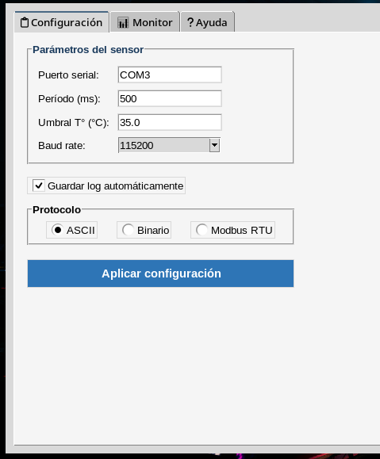</td>
    </tr>
    <tr>
      <td>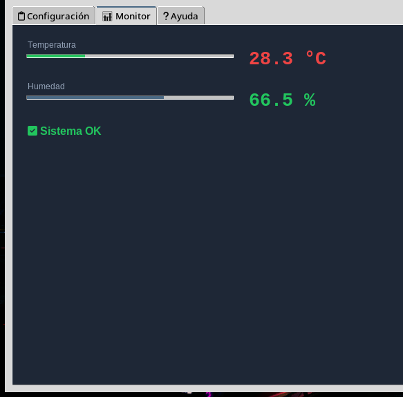</td>
      <td>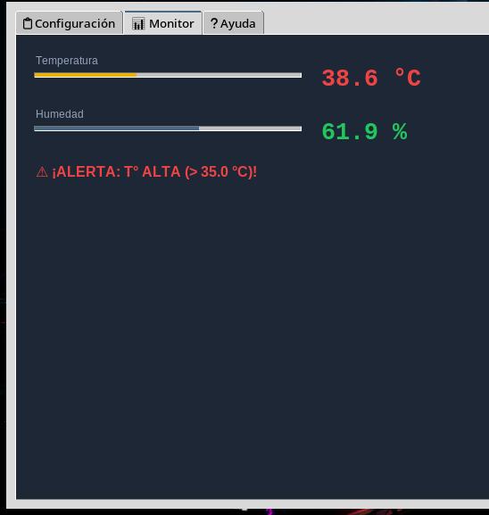</td>
      <td>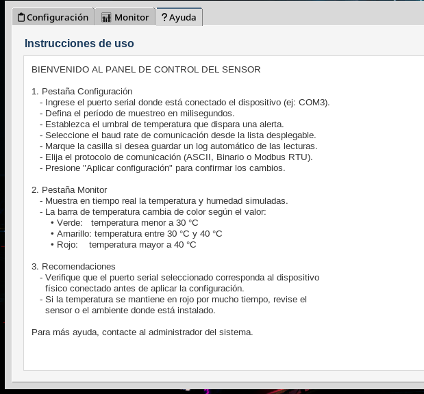</td>
    </tr>
  </table>

### 3. Canvas — Indicadores Visuales y Animaciones (Lab Tk-3)
* **Objetivos**: `Canvas`, `create_oval`, `create_rectangle`, `itemconfig`, `after()`.
* **Descripción**: Dibujo geométrico y creación de animaciones. Ideal para simular indicadores visuales tipo LED o barras dinámicas.
* **Evidencias**:
  <table>
    <tr>
      <td></td>
      <td></td>
      <td></td>
    </tr>
  </table>

### 4. Diseño con Figma → Traducción a Tkinter (Lab Tk-4)
* **Objetivos**: Prototipado UX/UI, Sistemas de diseño, Mockup a Código.
* **Descripción**: Diseño preliminar de una interfaz HMI profesional en Figma y su traducción exacta y estructurada a código Tkinter.
* **Evidencias**:
  <table>
    <tr>
      <td>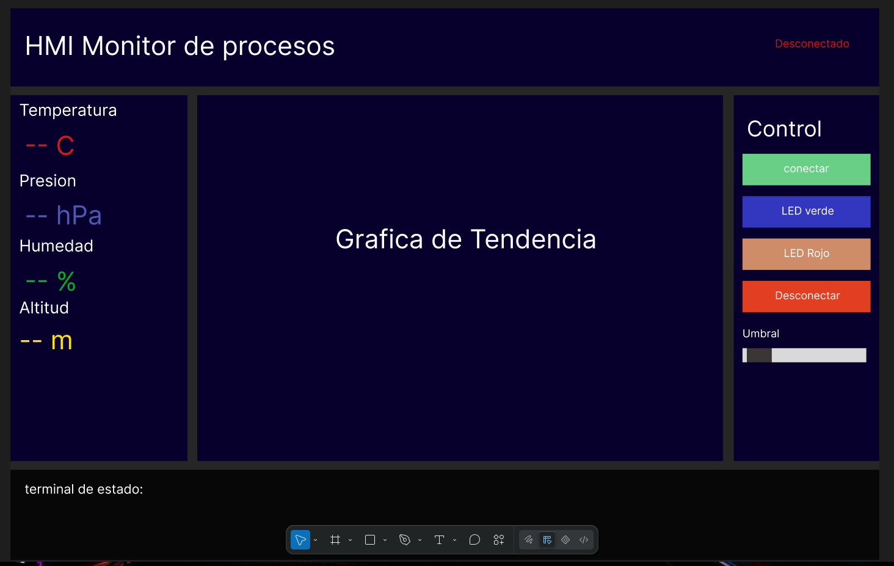</td>
      <td>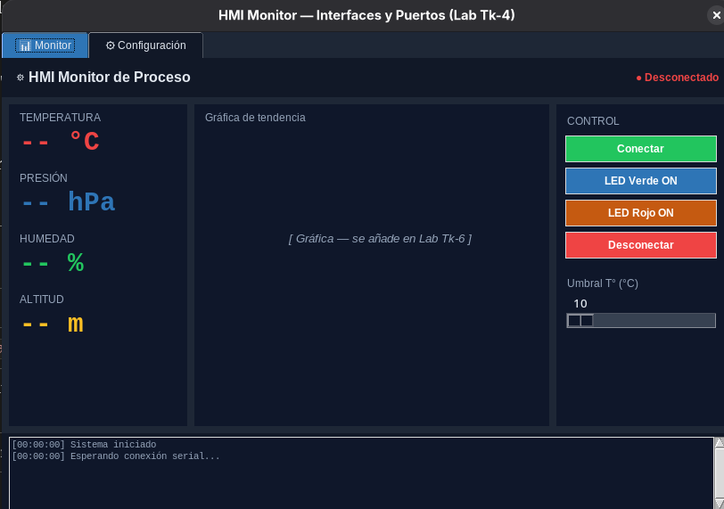</td>
    </tr>
  </table>

### 5. Menús, Diálogos y Eventos de Teclado (Lab Tk-5)
* **Objetivos**: `Menu`, `filedialog`, `colorchooser`, `bind`, `event`, `Toplevel`.
* **Descripción**: Creación de menús profesionales, atajos de teclado, cuadros de diálogo para abrir/guardar archivos, paletas de colores y ventanas flotantes secundarias.
* **Evidencias**:
  <table>
    <tr>
      <td></td>
      <td></td>
      <td></td>
    </tr>
    <tr>
      <td></td>
      <td colspan="2"></td>
    </tr>
  </table>

### 6. Gráfica en Tiempo Real con Matplotlib (Lab Tk-6)
* **Objetivos**: `FigureCanvasTkAgg`, `animation`, `after()`, `deque`, multi-eje.
* **Descripción**: Embeber gráficos dinámicos de `matplotlib` en la UI de Tkinter actualizándose periódicamente con `after()` sin congelar el hilo de ejecución principal.
* **Evidencias**:
  <table>
    <tr>
      <td></td>
      <td></td>
    </tr>
  </table>

### 7. Tkinter + Hilos + Puerto Serial (Lab Tk-7)
* **Objetivos**: `threading`, `queue.Queue`, `pyserial`, arquitectura sin bloqueo.
* **Descripción**: Recepción de datos de sensores por puerto serial UART desde un microcontrolador usando un hilo secundario (background thread) y paso de datos seguro mediante colas (`queue.Queue`) al hilo de la interfaz.
* **Evidencias**:
  <br>
  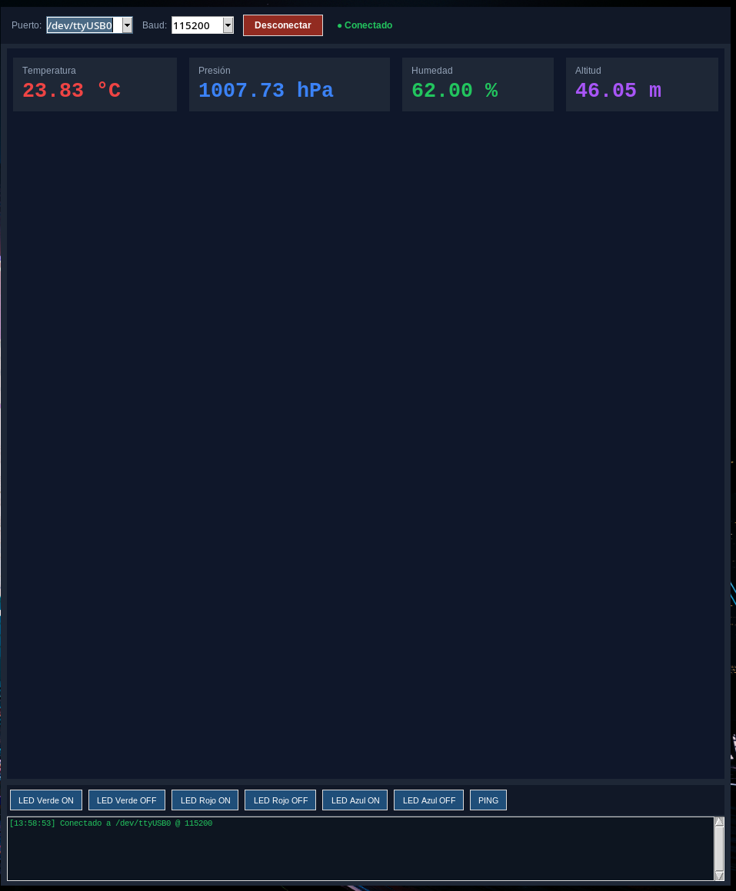

### 8. Dashboard Serial Completo (Lab Tk-8)
* **Objetivos**: Integración de interfaz oscura, gráficas matplotlib, alarmas visuales, registro en CSV, multihilo y puerto serial.
* **Descripción**: Proyecto integrador HMI definitivo. Reúne la comunicación serial multihilo, visualización gráfica en tiempo real de múltiples sensores, panel de control interactivo, log e historial con exportación CSV.
* **Evidencias**:
  <table>
    <tr>
      <td>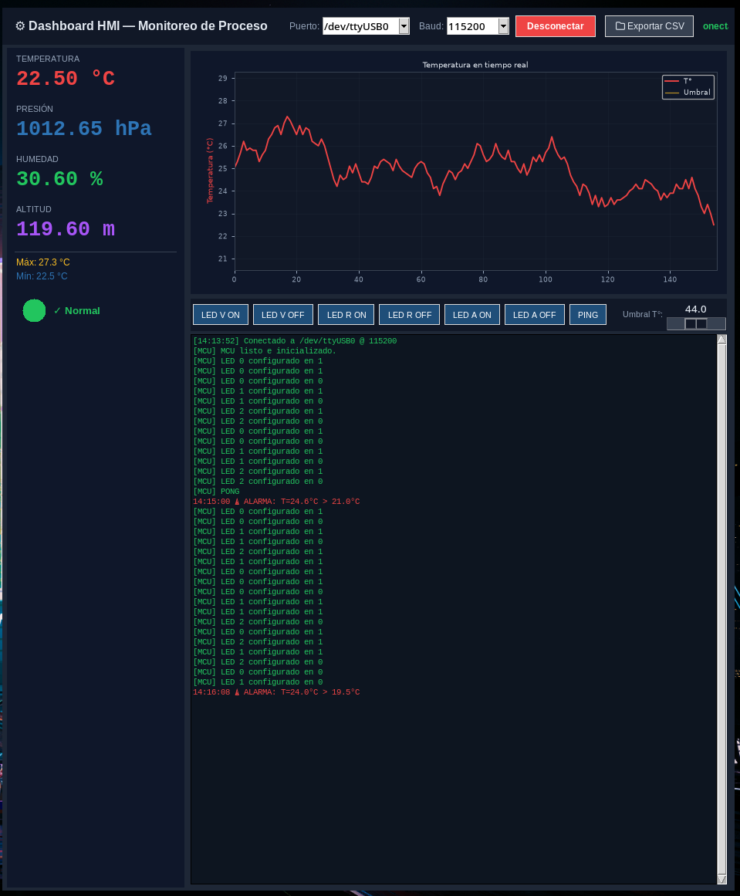</td>
      <td>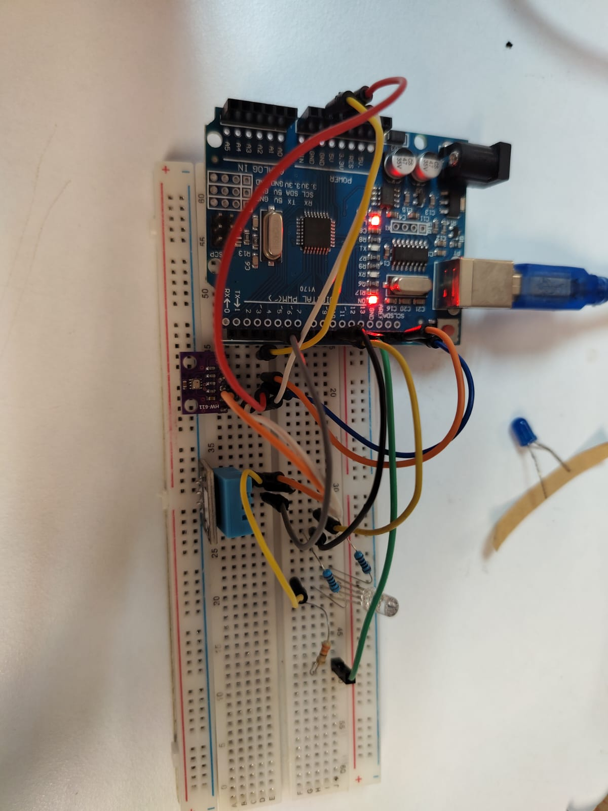</td>
    </tr>
  </table>
