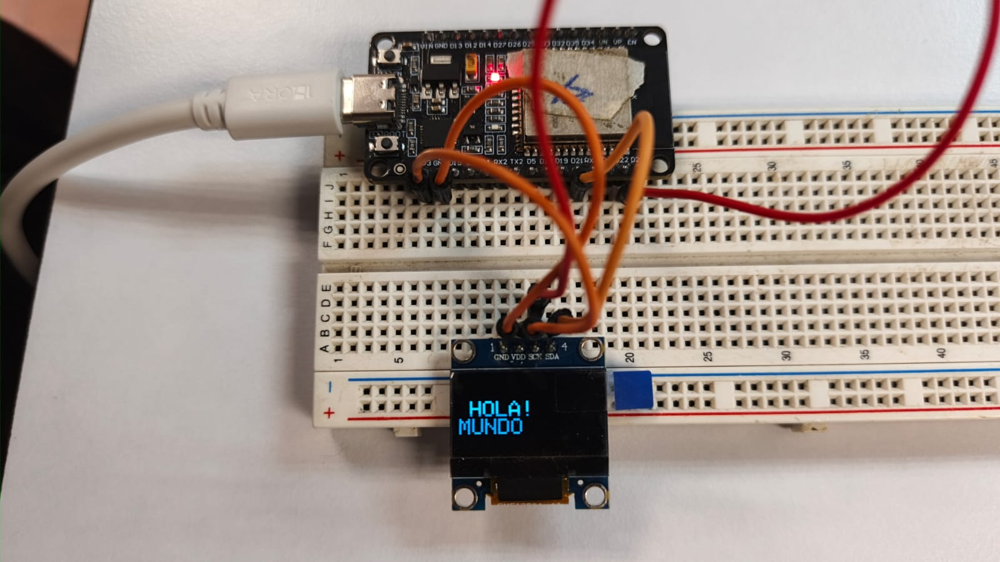
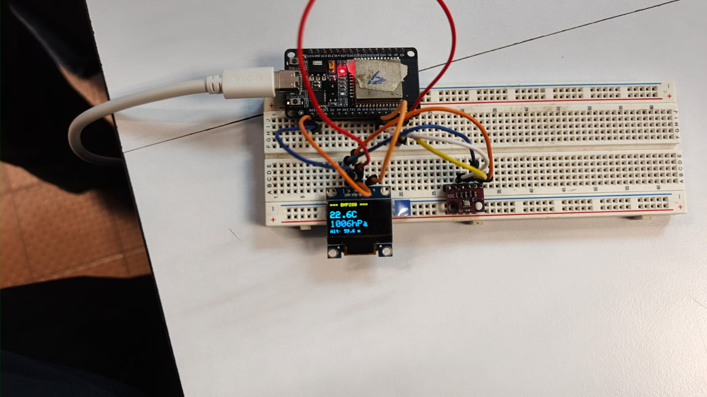

# Control de Temperatura con ESP32, BMP280 y OLED

Práctica de laboratorio de la materia Programación de Sistemas Embebidos, enfocada en el protocolo de comunicación I2C. Después de revisar la teoría sobre protocolos de transferencia de datos (I2C, SPI, UART), se implementó un sistema real con ESP32 que comunica dos dispositivos por el mismo bus I2C: una pantalla OLED SSD1306 y un sensor de temperatura/presión BMP280.
La práctica se desarrolló en dos fases: primero se validó la comunicación con la pantalla mostrando un mensaje de prueba, y después se integró el sensor para mostrar lecturas en tiempo real con control de alertas por temperatura.

---

## Evidencia del proyecto

### Fase 1 — Prueba inicial de la pantalla OLED (¡Hola Mundo!)

Antes de conectar el sensor, se validó que la pantalla OLED respondía correctamente mostrando un mensaje de prueba.





### Fase 2 — Sistema completo con sensor BMP280

Con el sensor ya conectado, el sistema muestra en tiempo real: temperatura, presión y altitud estimada.



> **Lecturas en pantalla:** `22.6 °C | 1006 hPa | Alt: 59.6 m`


### Video de funcionamiento


*Arranque, lectura en vivo y activación del LED de alerta.*

---

## Hardware utilizado

| Componente | Descripción |
|---|---|
| ESP32 (Node32s / DevKit) | Microcontrolador principal con Wi-Fi y I2C |
| BMP280 | Sensor de temperatura y presión barométrica |
| OLED 0.96" SSD1306 | Pantalla I2C 128×64 px |
| LED (GPIO 4) | Indicador visual de alerta por temperatura alta |
| Breadboard + jumpers | Prototipado |

---

## Conexiones I2C

| Señal | ESP32 GPIO |
|---|---|
| SDA | GPIO 21 |
| SCL | GPIO 22 |
| VCC | 3.3 V |
| GND | GND |

Tanto la pantalla OLED (dirección `0x3C`) como el sensor BMP280 (dirección `0x76` o `0x77`) comparten el mismo bus I2C.


## Lógica del programa

### Umbrales de temperatura (histéresis)

```cpp
#define TEMP_LOW   22.8f   // LED se apaga cuando baja de aquí
#define TEMP_HIGH  24.0f   // LED se enciende cuando supera esto
```

La histéresis evita que el LED parpadee rápidamente cuando la temperatura oscila alrededor del umbral.

### Recuperación automática del sensor

Si el BMP280 devuelve valores inválidos (NaN, fuera de rango físico), el firmware:
1. Muestra mensaje de error en OLED
2. Reinicia el bus I2C
3. Vuelve a inicializar el sensor
4. Retoma la lectura normal sin necesidad de resetear el ESP32

---

##  Dependencias (PlatformIO / Arduino IDE)

```ini
; platformio.ini
[env:esp32dev]
platform = espressif32
board = esp32dev
framework = arduino
lib_deps =
    adafruit/Adafruit GFX Library
    adafruit/Adafruit SSD1306
    adafruit/Adafruit BMP280 Library
```

---


*12 \ Junio \ 2026*